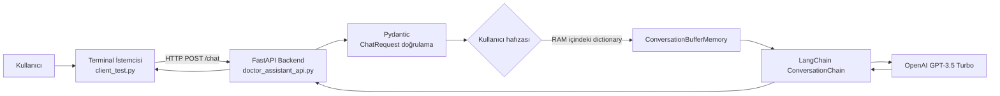

# GPT Doktor Asistanı

OpenAI GPT ve LangChain kullanarak sağlık sorularına konuşma bağlamını koruyarak yanıt veren bir doktor asistanı API projesi.

> **Tıbbi uyarı:** Bu proje eğitim ve prototip amaçlıdır. Tanı koymaz, reçete yazmaz ve profesyonel sağlık hizmetinin yerini tutmaz. Acil durumlarda yerel acil yardım hattına veya en yakın sağlık kuruluşuna başvurun.

## İçindekiler

- [Özellikler](#özellikler)
- [Mimari](#mimari)
- [Proje Yapısı](#proje-yapısı)
- [Kullanılan Teknolojiler](#kullanılan-teknolojiler)
- [Kurulum](#kurulum)
- [Çalıştırma](#çalıştırma)
- [API Kullanımı](#api-kullanımı)
- [Ekran Görüntüleri](#ekran-görüntüleri)
- [Mevcut Sınırlamalar](#mevcut-sınırlamalar)
- [Gelecek Geliştirmeler](#gelecek-geliştirmeler)

## Özellikler

- FastAPI ile `POST /chat` sohbet endpoint'i
- OpenAI GPT-3.5 Turbo ile doğal dil yanıtları
- LangChain `ConversationChain` ve `ConversationBufferMemory` ile konuşma bağlamı
- Kullanıcı adı ve yaş bilgisine göre kişiselleştirilmiş başlangıç prompt'u
- Swagger UI üzerinden otomatik API dokümantasyonu
- Terminal üzerinden sürekli sohbet istemcisi

## Mimari



İstek akışı:

1. Kullanıcı adını, yaşını ve mesajını terminale girer.
2. `client_test.py`, JSON gövdesiyle `/chat` endpoint'ine `POST` isteği gönderir.
3. FastAPI isteği `ChatRequest` modeliyle doğrular.
4. Backend, kullanıcıya ait konuşma hafızasını bulur veya oluşturur.
5. LangChain, geçmiş mesajları ve yeni mesajı GPT modeline iletir.
6. Model yanıtı API üzerinden istemciye döndürülür.

## Proje Yapısı

```text
GPT_doktor_asistan/
├── doctor_assistant_api.py       # FastAPI backend ve /chat endpoint'i
├── doctor_assistant_terminal.py  # Doğrudan terminalde çalışan chatbot
├── client_test.py                # FastAPI için terminal istemcisi
├── requirements.txt              # Python bağımlılıkları
├── .env.example                  # Ortam değişkeni şablonu
├── .gitignore                    # Gizli dosya ve yerel dosya kuralları
└── readme.md                     # Proje dokümantasyonu
```

## Kullanılan Teknolojiler

| Teknoloji | Kullanım amacı |
| --- | --- |
| Python | Uygulama dili |
| FastAPI | REST API backend'i |
| Uvicorn | ASGI uygulama sunucusu |
| LangChain | LLM zinciri ve konuşma hafızası |
| OpenAI API | GPT-3.5 Turbo model erişimi |
| Pydantic | İstek ve cevap şemaları |
| python-dotenv | `.env` dosyasından API anahtarı okuma |
| Requests | Terminal istemcisinden HTTP isteği gönderme |


## Kurulum

### Gereksinimler

- Python 3.10 veya üzeri
- OpenAI API anahtarı
- İnternet bağlantısı

### 1. Projeyi klonlayın

```bash
git clone <REPOSITORY_URL>
cd GPT_doktor_asistan
```

### 2. Sanal ortam oluşturun

Windows PowerShell:

```powershell
python -m venv venv
.\venv\Scripts\Activate.ps1
```

Windows komut istemi:

```bat
venv\Scripts\activate
```

macOS/Linux:

```bash
python3 -m venv venv
source venv/bin/activate
```

### 3. Bağımlılıkları yükleyin

```bash
python -m pip install --upgrade pip
pip install -r requirements.txt
```

### 4. API anahtarını tanımlayın

`.env.example` dosyasını `.env` adıyla kopyalayın ve kendi anahtarınızı ekleyin:

```powershell
Copy-Item .env.example .env
```

`.env`:

```env
OPENAI_API_KEY=your_openai_api_key_here
```

`.env` dosyası `.gitignore` içinde olduğu için GitHub'a gönderilmemelidir.

## Çalıştırma

### FastAPI backend'i başlatma

```bash
uvicorn doctor_assistant_api:app --reload
```

Backend şu adreste çalışır:

- API: <http://127.0.0.1:8000>
- Swagger UI: <http://127.0.0.1:8000/docs>
- OpenAPI JSON: <http://127.0.0.1:8000/openapi.json>

### Terminal istemcisini başlatma

Backend çalışırken ikinci bir terminal açın:

```bash
python client_test.py
```

Ardından adınızı, yaşınızı ve mesajınızı girin. Sohbetten çıkmak için `quit` yazın.

### Sadece terminal sürümünü çalıştırma

FastAPI kullanmadan doğrudan LangChain tabanlı sürümü çalıştırmak için:

```bash
python doctor_assistant_terminal.py
```

## API Kullanımı

### İstek

```http
POST /chat
Content-Type: application/json
```

```json
{
	"name": "Ali",
	"age": 35,
	"message": "Son iki gündür başım ağrıyor."
}
```

### Cevap

```json
{
	"response": "Geçmiş olsun..."
}
```

### cURL örneği

```bash
curl -X POST "http://127.0.0.1:8000/chat" \
	-H "Content-Type: application/json" \
	-d "{\"name\":\"Ali\",\"age\":35,\"message\":\"Başım ağrıyor.\"}"
```

## Ekran Görüntüleri

### Swagger UI

Backend çalışırken <http://127.0.0.1:8000/docs> adresi açıldığında FastAPI'nin otomatik API test ekranı görüntülenir. Buradan `POST /chat` endpoint'ini genişletip **Try it out** ile istek gönderebilirsiniz.

### Terminal istemcisi

`python client_test.py` komutundan sonra terminalde ad, yaş ve mesaj bilgileri istenir; API yanıtı `Doktor Asistanı:` etiketiyle gösterilir.

> Gerçek çalışma ekran görüntüleri lokal olarak `docs/screenshots/` klasöründe tutulabilir. Bu klasör `.gitignore` tarafından gizlendiği için GitHub'a gönderilmez. Ekran görüntülerini yalnızca lokal README önizlemesinde göstermek için aşağıdaki görselleri aktif hale getirebilirsiniz:
>
> ```markdown
> 
> 
> ```

## Git ve GitHub

Projede bulunan `.gitignore` dosyası aşağıdaki yerel dosyaların GitHub'a gönderilmesini engeller:

- `.env` ve diğer gizli ortam dosyaları
- `venv/`, `.venv/` ve `env/` sanal ortam klasörleri
- Python önbellek dosyaları ve test çıktıları
- Yerel database, log ve build dosyaları
- IDE ayar klasörleri

`.env.example`, başkalarının kendi API anahtarını tanımlayabilmesi için özellikle repository'de tutulur. Lokal çalışma ekran görüntüleri ise `docs/screenshots/` klasöründe saklanır ve bu klasör GitHub'a gönderilmez.

## Veri Saklama ve Hafıza

Bu sürümde kalıcı bir database bulunmamaktadır. Kullanıcı konuşmaları backend sürecinin RAM'inde şu yapı ile tutulur:

```python
user_memories: Dict[str, ConversationBufferMemory]
```

Bu nedenle uygulama yeniden başlatıldığında konuşma geçmişi silinir. Üretim ortamı için PostgreSQL ile kalıcı mesaj saklama ve Redis ile hızlı sohbet hafızası eklenmesi önerilir.

## Mevcut Sınırlamalar

- Gerçek frontend bulunmuyor; istemci terminal tabanlıdır.
- Kullanıcı kimlik doğrulama ve yetkilendirme yoktur.
- Hafıza RAM'de tutulur ve yeniden başlatmada kaybolur.
- Hafıza kullanıcı adıyla anahtarlanır; aynı ada sahip kullanıcılar çakışabilir.
- Sağlık yanıtları için klinik doğrulama, kaynak gösterme ve acil durum yönlendirme katmanı bulunmamaktadır.
- Üretim ortamı için rate limiting, merkezi loglama ve izleme eklenmelidir.

## Gelecek Geliştirmeler

- React veya Vue tabanlı web frontend'i
- Kullanıcı hesabı ve JWT authentication
- PostgreSQL ile kullanıcı, sohbet ve mesaj tabloları
- Redis tabanlı geçici memory ve cache
- Tıbbi kaynaklara dayalı RAG sistemi
- Acil durum tespiti ve güvenli yönlendirme kuralları
- Docker, CI/CD ve otomatik test pipeline'ı

## Lisans

Bu proje için henüz bir lisans belirtilmemiştir. GitHub'da açık kaynak olarak paylaşmadan önce uygun bir lisans ekleyin.


