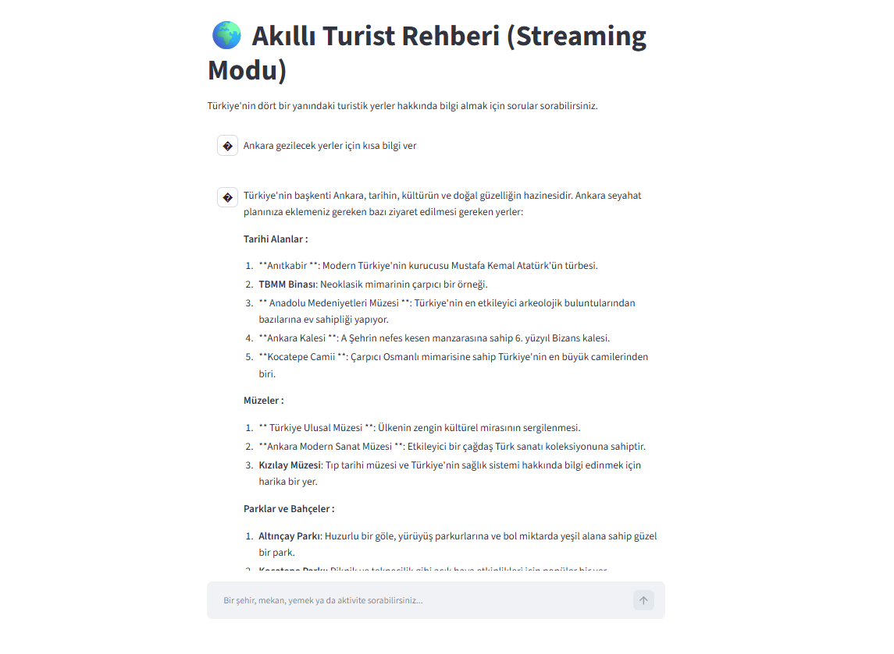

# 🌍 LLaMA Akıllı Turizm Rehberi

Türkiye'deki turistik yerler, tarihi mekanlar, yöresel yemekler ve ulaşım hakkında bilgi veren yerel yapay zeka destekli bir chatbot.

## 🚀 Özellikler

- 🦙 **LLaMA 3.2 (3B)** modeli ile tamamen yerel (local) çalışır — internet bağlantısı gerekmez
- 🌐 **Çeviri pipeline'ı**: Türkçe soru → İngilizce → LLM → Türkçe yanıt (temiz Türkçe çıktı için)
- 🧠 **Konuşma hafızası** ile bağlamı hatırlayan çok turlu diyalog
- 💬 **Terminal** ve **Streamlit web arayüzü** desteği

## 🛠️ Kullanılan Teknolojiler

| Katman | Araç |
|---|---|
| LLM | [LLaMA 3.2 3B](https://ollama.com/library/llama3.2) via [Ollama](https://ollama.com) |
| LLM Çerçevesi | [LangChain](https://www.langchain.com/) |
| Çeviri | [deep-translator](https://github.com/nidhaloff/deep-translator) (MyMemory API) |
| Web Arayüzü | [Streamlit](https://streamlit.io/) |

## ⚙️ Kurulum

### 1. Gereksinimler

- Python 3.10+
- [Ollama](https://ollama.com/download) kurulu ve çalışıyor olmalı

### 2. LLaMA modelini indir

`ash
ollama pull llama3.2:3b
`

### 3. Bağımlılıkları yükle

`ash
python -m venv venv
venv\Scripts\activate       # Windows
# source venv/bin/activate  # Linux/macOS

pip install -r requirements.txt
`

## ▶️ Çalıştırma

### Terminal (Konsol) Modu

`ash
python terminal_tourist_bot.py
`

### Streamlit Web Arayüzü

`ash
streamlit run streamlit_tourist_bot_streaming.py
`

Tarayıcıda otomatik olarak http://localhost:8501 açılacaktır.

## 💡 Mimari

`
Kullanıcı (Türkçe)
       ↓
  [TR → EN Çeviri]   ← MyMemory API
       ↓
  LLaMA 3.2 (3B)     ← Ollama (yerel)
       ↓
  [EN → TR Çeviri]   ← MyMemory API
       ↓
Kullanıcı (Türkçe)
`

> Model İngilizce düşünerek çok daha kaliteli yanıtlar üretir; çeviri katmanı ise kullanıcıya temiz Türkçe sunar.

## 📂 Proje Yapısı

`
LLaMA_akıllı_turizm/
├── terminal_tourist_bot.py           # Terminal tabanlı chatbot
├── streamlit_tourist_bot.py          # Streamlit arayüzü (standart)
├── streamlit_tourist_bot_streaming.py # Streamlit arayüzü (canlı yazım)
├── requirements.txt                   # Python bağımlılıkları
├── .gitignore
└── README.md
`

## 📝 Notlar

- MyMemory API ücretsiz tier'da günlük ~10.000 kelime çevirisi destekler.
- Uzun LLM yanıtları otomatik olarak 490 karakterlik parçalara bölünür ve sırayla çevrilir.
- Ollama lokalde çalıştığı için internet kesintisinde bile LLM yanıt üretmeye devam eder; yalnızca çeviri adımı internet ister.
