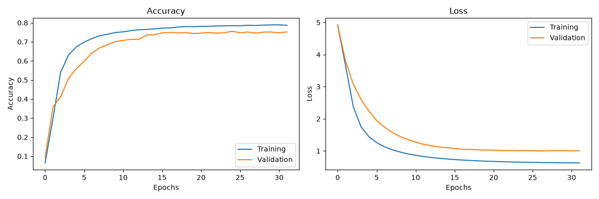

# LSTM ile Türkçe Motivasyon Metni Üretimi

Bu proje, bir başlangıç kelimesi veya kelime grubundan Türkçe motivasyon cümleleri üretmek için kelime tabanlı bir LSTM dil modeli kullanır.

Model, her cümlenin artan uzunluktaki kelime dizilerini eğitim örneklerine dönüştürür. Önceki kelimeler girdi, sıradaki kelime ise tahmin edilmesi gereken hedef olarak kullanılır.

## Özellikler

- Türkçe motivasyon cümleleriyle kelime tabanlı eğitim
- Embedding ve LSTM katmanlarından oluşan Keras modeli
- Doğrulama kaybını izleyen erken durdurma
- Eğitim ve doğrulama metriklerinin grafikle gösterilmesi
- Temperature sampling ile farklı metinler üretebilme
- Eğitilen model ve tokenizer'ın yerel olarak kaydedilmesi

## Proje yapısı

```text
.
├── train_lstm.py                 # Veriyi hazırlar ve modeli eğitir
├── generate.py                   # Eğitilmiş modelle metin üretir
├── motivasyon_cumleleri.txt      # Eğitim veri seti
├── Figure_2.png                  # Son eğitimin başarı ve kayıp grafiği
├── requirements.txt              # Doğrudan Python bağımlılıkları
├── .gitignore
└── README.md
```

`lstm_model.keras`, `tokenizer.pickle` ve `max_sequence_length.pickle` eğitim sırasında yeniden oluşturulan çıktılardır. Bu nedenle Git deposunda tutulmazlar.

## Kurulum

Python 3.12 ile yeni bir sanal ortam oluşturun:

```bash
python -m venv venv
```

Windows PowerShell üzerinde ortamı etkinleştirin:

```powershell
.\venv\Scripts\Activate.ps1
```

Bağımlılıkları yükleyin:

```bash
python -m pip install -r requirements.txt
```

## Modeli eğitme

```bash
python train_lstm.py
```

Eğitim tamamlandığında `lstm_model.keras`, `tokenizer.pickle` ve `max_sequence_length.pickle` dosyaları yerel olarak oluşturulur.

## Metin üretme

Önce modelin eğitilmiş olması gerekir. Ardından:

```bash
python generate.py
```

Örnek kullanım:

```text
Başlangıç kelimesi/kelimeleri girin: asla
Kaç kelime üretilsin: 5
asla denemekten korkma bu senin hikayen
```

Üretimde varsayılan temperature değeri `0.8`'dir. Düşük değerler daha tahmin edilebilir, yüksek değerler ise daha çeşitli fakat daha hatalı sonuçlar oluşturabilir.

## Eğitim sonucu

Son eğitim çalışmasında doğrulama doğruluğu yaklaşık `%75,6`, en düşük doğrulama kaybı ise yaklaşık `0,9997` olmuştur. Erken durdurma sayesinde iyileşme sona erdiğinde eğitim durdurulmuş ve en iyi ağırlıklar geri yüklenmiştir.



Bu değerler bir sonraki kelime tahmini başarısını gösterir; üretilen cümlelerin özgünlüğünü veya anlam kalitesini tek başına garanti etmez. Veri kümesindeki benzer kalıplar nedeniyle model bazı eğitim cümlelerini kısmen tekrar edebilir.

## Sınırlamalar ve geliştirme fikirleri

- Veri setinde yinelenen ve birbirine çok benzeyen cümleler bulunmaktadır.
- Mevcut doğrulama sonucu bağımsız bir test kümesi sonucu değildir.
- Varsayılan tokenizer noktalama işaretlerini kaldırdığı için cümle sonu özel bir token ile modellenmemektedir.
- Veri cümle bazında eğitim, doğrulama ve test kümelerine ayrılabilir.
- `<eos>` cümle sonu tokenı ile üretim daha doğru yerde durdurulabilir.
- Top-k veya top-p sampling ile üretim kalitesi iyileştirilebilir.
- Perplexity, tekrar oranı ve insan değerlendirmesi gibi ek ölçümler kullanılabilir.

## Platform notu

TensorFlow 2.11 ve sonrasında yerel Windows kurulumu NVIDIA GPU kullanmaz. GPU ile eğitim için WSL2 tercih edilebilir. Proje CPU üzerinde de çalışır ancak eğitim daha uzun sürebilir.

