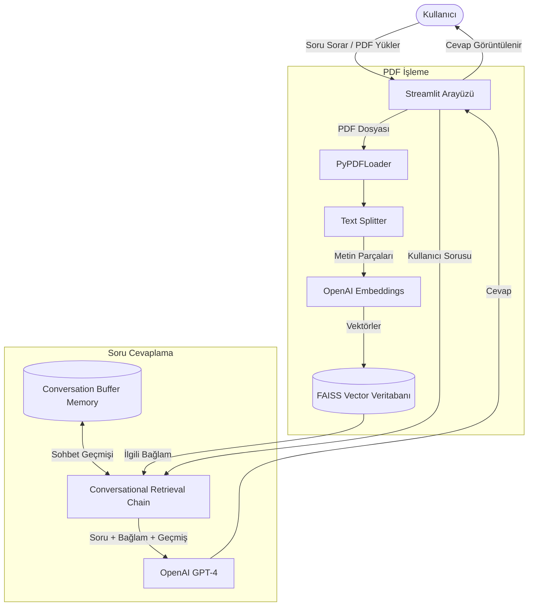

# Müşteri Destek Botu (RAG + Memory)

## Sistem Mimarisi



## Ne İşe Yarar?
Bu proje, şirketlerin sıkça sorulan sorular (FAQ) gibi bilgi dökümanlarını temel alan, akıllı bir müşteri destek asistanıdır. Kullanıcılar bir PDF dokümanı yükler ve asistan bu dokümanı analiz ederek kullanıcının sorduğu sorulara anında, doğru ve bağlama uygun Türkçe cevaplar verir. Geçmiş konuşmaları hatırlama (memory) özelliği sayesinde sohbetin akışını takip edebilir.

## Nasıl Çalışır?
Sistem temel olarak RAG (Retrieval-Augmented Generation) mimarisi üzerine kuruludur:
1. **Belge Yükleme ve Parçalama:** Streamlit arayüzünden yüklenen PDF belgesi veya önceden işlenen belgeler metinlere dönüştürülür ve anlamlı parçalara (chunk) ayrılır.
2. **Vektörleştirme (Embedding):** Parçalara ayrılan metinler OpenAI'ın embedding modeli kullanılarak vektörlere dönüştürülür ve FAISS veri tabanına kaydedilir.
3. **Sorgulama (Retrieval):** Kullanıcı bir soru sorduğunda, bu soru da vektörleştirilir ve FAISS veri tabanında anlam olarak en çok benzeyen kısımlar bulunur.
4. **Cevap Üretme (Generation):** Bulunan bu metinler, kullanıcının sorusu ve önceki sohbet geçmişi birleştirilerek OpenAI GPT-4 modeline gönderilir. Model bu bağlamı kullanarak tamamen Türkçe ve tutarlı bir yanıt üretir.

## Hangi Problemi Çözüyor?
Müşteri hizmetleri genellikle "Şifremi unuttum", "İade süresi kaç gün?", "Kargo ücretiniz ne kadar?" gibi sık sorulan, tekrarlayan sorularla vakit kaybeder. Bu proje sayesinde:
- Müşteriler saniyeler içinde doğru yanıtlara ulaşır.
- Destek ekiplerinin iş yükü azalır.
- Her seferinde aynı PDF dosyası üzerinde manuel arama yapma ihtiyacı ortadan kalkar.
- İnsan hataları minimize edilir ve 7/24 hizmet sağlanır.

## Kullanılan Teknolojiler ve Neden Seçildikleri?
- **Langchain:** RAG mimarisini kurmak, LLM zincirlerini (chain) yönetmek ve bileşenleri kolayca entegre etmek için seçildi.
- **FAISS (Facebook AI Similarity Search):** Metin vektörlerini saklamak ve kullanıcı sorgularına en uygun metinleri son derece hızlı bir şekilde bulmak (vektör araması) için tercih edildi.
- **OpenAI (text-embedding-3-large & GPT-4):** Soru cevaplama kalitesinin yüksek olması ve özellikle Türkçe dil desteğinin piyasadaki diğer modellere kıyasla çok daha iyi olması sebebiyle seçildi.
- **Streamlit:** Python kodu ile hızlıca interaktif, modern ve kullanıcı dostu web arayüzleri oluşturabilmek için kullanıldı.
- **ConversationBufferMemory:** Chatbotun önceki konuşmaları hatırlaması, sohbette bağlamı kaybetmemesi ve doğal bir diyalog hissi yaratması için entegre edildi.

## PDF Yükleme Ekran Görüntüsü


## ChatBot Ekran Görüntüsü


## Kurulum ve Çalıştırma

1. Projeyi bilgisayarınıza klonlayın veya indirin.
2. Proje dizininde bir sanal ortam oluşturun ve aktif edin:
```bash
python -m venv venv
# Windows için
venv\Scripts\activate
# MacOS/Linux için
source venv/bin/activate
```
3. Gerekli kütüphaneleri yükleyin:
```bash
pip install -r requirements.txt
```
4. Projenin ana dizininde `.env` adlı bir dosya oluşturun ve OpenAI API anahtarınızı ekleyin:
```
OPENAI_API_KEY=your_openai_api_key_here
```
5. Uygulamayı çalıştırın:
```bash
streamlit run streamlit_app.py
```
*(Eğer arayüzsüz terminal versiyonunu çalıştırmak isterseniz önce `load_pdf_and_embed.py` çalıştırarak vektör veritabanını oluşturun, sonra `chatbot_rag_memory.py` dosyasını çalıştırın.)*
