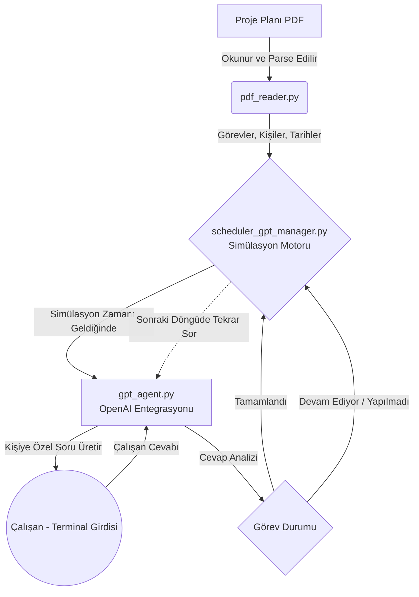

# Akıllı Proje Yöneticisi (RAG + Scheduler)

## Sistem Mimarisi



## Ne İşe Yarar?
Bu proje, PDF formatında hazırlanmış bir proje planını okuyarak ekip üyelerine gerçek zamanlı görev hatırlatmaları yapan ve durum takibi sağlayan yapay zeka destekli akıllı bir proje yöneticisidir. Sistemin temel amacı, görev atanan kişilere zamanı geldiğinde görevlerinin durumunu sormak, verdikleri doğal dil cevaplarını analiz etmek ve görev bitene kadar kişiye özel bağlamla (önceki konuşmaları hatırlayarak) takip yapmaktır.

## Nasıl Çalışır?
Sistem 3 temel bileşen üzerinden çalışır:
1. **PDF Okuyucu (`pdf_reader.py`)**: `PyPDF2` kullanarak "Kişi - Tarih - Görev" formatındaki metinleri düzenli ifadeler (regex) ile ayıklar ve yapılandırılmış görev listeleri oluşturur.
2. **Görev Yöneticisi ve Simülasyon (`scheduler_gpt_manager.py`)**: Zamanı simüle eden ana döngüdür. Her döngüde zamanı ilerletir (örneğin 1 dakikalık sıçramalarla) ve zamanı gelmiş görevler için GPT ajanı üzerinden çalışana soru yöneltilmesini tetikler. Çalışanların cevaplarını hafızada tutar.
3. **Yapay Zeka Ajanı (`gpt_agent.py`)**: OpenAI API'sini kullanarak iki işlev sunar:
   - *Soru Sorma*: Çalışanın görevine, mevcut zamana ve önceki konuşma geçmişine bakarak doğal, kişiselleştirilmiş ve bağlama uygun sorular üretir.
   - *Cevap Analizi*: Çalışanın verdiği cevabı analiz ederek görevin "tamamlandı", "devam ediyor" veya "yapılmadı" durumlarından hangisinde olduğuna karar verir. Görev tamamlanmışsa sistem bir daha o görev için soru sormaz.

## Kurulum
1. Repoyu bilgisayarınıza klonlayın veya indirin.
2. Proje dizininde bir sanal ortam oluşturun ve aktif edin:
   ```bash
   python -m venv venv
   # Windows için:
   venv\Scripts\activate
   # macOS/Linux için:
   source venv/bin/activate
   ```
3. Gerekli kütüphaneleri yükleyin:
   ```bash
   pip install -r requirements.txt
   ```
4. Proje ana dizininde bir `.env` dosyası oluşturun ve içerisine OpenAI API anahtarınızı ekleyin:
   ```env
   OPENAI_API_KEY=sk-xxxx...
   ```
5. Sistemi başlatmak için terminalden simülasyonu çalıştırın:
   ```bash
   python scheduler_gpt_manager.py
   ```
**Terminal Ekran Görüntüsü**


## Çözdüğü Problem
Projelerde manuel görev takibi yapmak, sürekli "Bu iş ne oldu?" diye sormak yöneticiler için zaman alıcı ve yorucu bir süreçtir. Ayrıca otomatik hatırlatıcılar genelde mekaniktir ve çalışanın durumunu (örn: "başladım ama veritabanında sorun çıktı") anlayamaz. Bu proje, görev takibini otomatikleştirirken **insansı bir etkileşim** sunar. Çalışanın verdiği cevapları anlayarak mekanik hatırlatıcıların ötesine geçer ve gerçekten projenin gidişatına dair akıllı bir asistan görevi üstlenir.

## Kullanılan Teknolojiler ve Nedenleri
* **Python**: Veri işleme, yapay zeka entegrasyonu ve hızlı prototipleme için en uygun dil olması.
* **OpenAI API (gpt-3.5-turbo)**: Karmaşık metinleri anlama ve doğal dilde cevap/soru üretme yetenekleri için kullanıldı. Ajan mantığını (Agentic AI) kurabilmek için temel zeka katmanıdır.
* **PyPDF2**: Proje belgeleri genellikle PDF olarak paylaşıldığı için PDF içindeki metinleri zahmetsizce okuyup parçalamak adına kullanıldı.
* **Rich**: Terminal üzerinde çalışan bir uygulamanın daha profesyonel, renkli ve okunabilir bir arayüze sahip olması için (özellikle loglama ve soru kısımlarında) tercih edildi.
* **python-dotenv**: API anahtarları gibi hassas bilgilerin kod içerisine gömülmeden, güvenli bir çevre (environment) dosyasından okunmasını sağlamak için seçildi.
